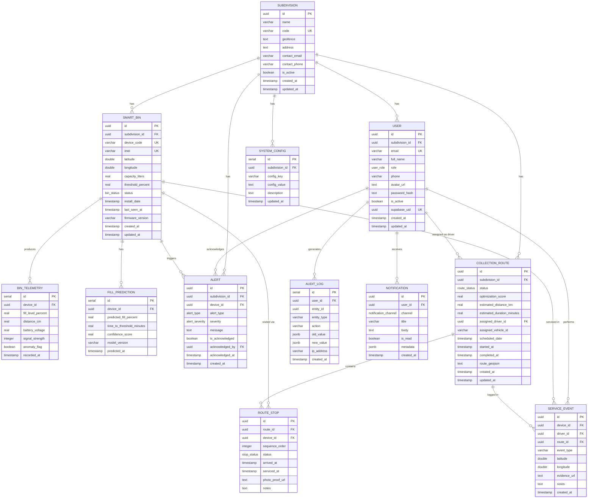

# EcoRoute – Entity Relationship Diagram

```mermaid
erDiagram
    SUBDIVISION {
        uuid id PK
        varchar name
        varchar code UK
        text geofence
        text address
        varchar contact_email
        varchar contact_phone
        boolean is_active
        timestamp created_at
        timestamp updated_at
    }

    USER {
        uuid id PK
        uuid subdivision_id FK
        varchar email UK
        varchar full_name
        user_role role
        varchar phone
        text avatar_url
        text password_hash
        boolean is_active
        uuid supabase_uid UK
        timestamp created_at
        timestamp updated_at
    }

    SMART_BIN {
        uuid id PK
        uuid subdivision_id FK
        varchar device_code UK
        varchar imei UK
        double latitude
        double longitude
        real capacity_liters
        real threshold_percent
        bin_status status
        timestamp install_date
        timestamp last_seen_at
        varchar firmware_version
        timestamp created_at
        timestamp updated_at
    }

    BIN_TELEMETRY {
        serial id PK
        uuid device_id FK
        real fill_level_percent
        real distance_cm
        real battery_voltage
        integer signal_strength
        boolean anomaly_flag
        timestamp recorded_at
    }

    FILL_PREDICTION {
        serial id PK
        uuid device_id FK
        real predicted_fill_percent
        real time_to_threshold_minutes
        real confidence_score
        varchar model_version
        timestamp predicted_at
    }

    ALERT {
        uuid id PK
        uuid subdivision_id FK
        uuid device_id FK
        alert_type alert_type
        alert_severity severity
        text message
        boolean is_acknowledged
        uuid acknowledged_by FK
        timestamp acknowledged_at
        timestamp created_at
    }

    COLLECTION_ROUTE {
        uuid id PK
        uuid subdivision_id FK
        route_status status
        real optimization_score
        real estimated_distance_km
        real estimated_duration_minutes
        uuid assigned_driver_id FK
        varchar assigned_vehicle_id
        timestamp scheduled_date
        timestamp started_at
        timestamp completed_at
        text route_geojson
        timestamp created_at
        timestamp updated_at
    }

    ROUTE_STOP {
        uuid id PK
        uuid route_id FK
        uuid device_id FK
        integer sequence_order
        stop_status status
        timestamp arrived_at
        timestamp serviced_at
        text photo_proof_url
        text notes
    }

    SERVICE_EVENT {
        uuid id PK
        uuid device_id FK
        uuid driver_id FK
        uuid route_id FK
        varchar event_type
        double latitude
        double longitude
        text evidence_url
        text notes
        timestamp created_at
    }

    AUDIT_LOG {
        serial id PK
        uuid user_id FK
        uuid entity_id
        varchar entity_type
        varchar action
        jsonb old_value
        jsonb new_value
        varchar ip_address
        timestamp created_at
    }

    NOTIFICATION {
        uuid id PK
        uuid user_id FK
        notification_channel channel
        varchar title
        text body
        boolean is_read
        jsonb metadata
        timestamp created_at
    }

    SYSTEM_CONFIG {
        serial id PK
        uuid subdivision_id FK
        varchar config_key
        text config_value
        text description
        timestamp updated_at
    }

    %% Relationships
    SUBDIVISION ||--o{ USER : "has"
    SUBDIVISION ||--o{ SMART_BIN : "has"
    SUBDIVISION ||--o{ ALERT : "has"
    SUBDIVISION ||--o{ COLLECTION_ROUTE : "has"
    SUBDIVISION ||--o{ SYSTEM_CONFIG : "has"

    USER ||--o{ COLLECTION_ROUTE : "assigned as driver"
    USER ||--o{ SERVICE_EVENT : "performs"
    USER ||--o{ NOTIFICATION : "receives"
    USER ||--o{ AUDIT_LOG : "generates"
    USER ||--o{ ALERT : "acknowledges"

    SMART_BIN ||--o{ BIN_TELEMETRY : "produces"
    SMART_BIN ||--o{ FILL_PREDICTION : "has"
    SMART_BIN ||--o{ ALERT : "triggers"
    SMART_BIN ||--o{ ROUTE_STOP : "visited via"
    SMART_BIN ||--o{ SERVICE_EVENT : "serviced in"

    COLLECTION_ROUTE ||--o{ ROUTE_STOP : "contains"
    COLLECTION_ROUTE ||--o{ SERVICE_EVENT : "logged in"
```
