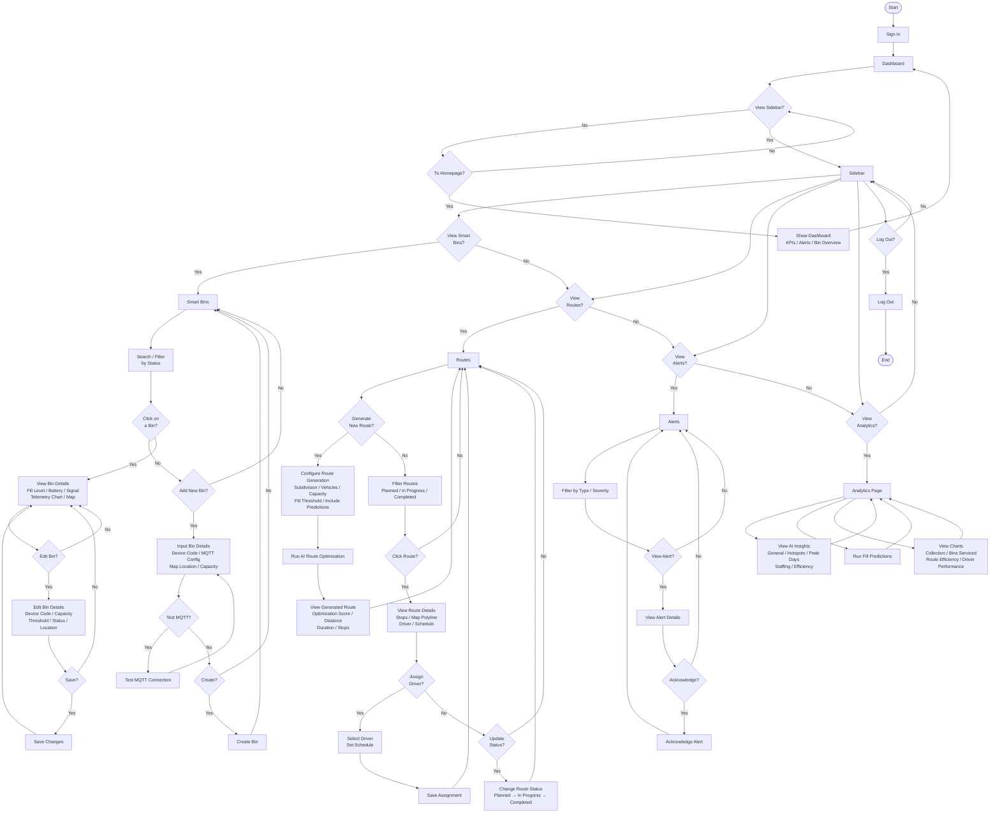
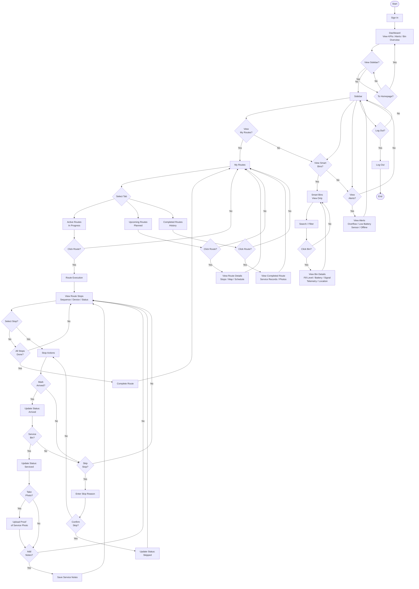

# EcoRoute — Program Workflow

## System Roles

| Role | Description |
|------|-------------|
| **Admin** | Full system access — user management, system settings, bin management, analytics, AI configuration |
| **Dispatcher** | Operational control — route planning, bin monitoring, alert management, analytics |
| **Maintenance** | Field operations — bin servicing, maintenance tasks, route execution, proof of service |

---

## Figure 1: Program Workflow (Admin)

```mermaid
flowchart TD
    Start([Start]) --> SignIn[Sign In]
    SignIn --> Dashboard[Dashboard]
    Dashboard --> ViewSidebar{View Sidebar?}

    ViewSidebar -- No --> ToHomepage{To Homepage?}
    ToHomepage -- Yes --> ShowAnalytics[Show Overall Analytics]
    ShowAnalytics --> Dashboard
    ToHomepage -- No --> ViewSidebar

    ViewSidebar -- Yes --> Sidebar[Sidebar]

    Sidebar --> ViewUserMgmt{View User\nManagement?}
    Sidebar --> ViewBins{View Smart\nBins?}
    Sidebar --> ViewSettings{View\nSettings?}
    Sidebar --> ViewAnalytics{View\nAnalytics?}
    Sidebar --> ViewAlerts{View\nAlerts?}
    Sidebar --> ViewSubdivisions{View\nSubdivisions?}

    %% ── User Management ──
    ViewUserMgmt -- Yes --> UserMgmt[User Management]
    ViewUserMgmt -- No --> ViewBins

    UserMgmt --> ViewUserList{View User\nAccount List?}
    ViewUserList -- Yes --> UserList[Show All Accounts]
    ViewUserList -- No --> ViewActivityLogs{View Activity\nLogs?}
    ViewActivityLogs -- Yes --> ActivityLogs[Show Activity Logs]
    ViewActivityLogs -- No --> Sidebar

    UserList --> ClickAccount{Click on an\naccount?}
    ClickAccount -- No --> UserList
    ClickAccount -- Yes --> ViewAccount[View Account]

    ViewAccount --> ToEdit{Edit User?}
    ToEdit -- Yes --> EditUser[Edit User Details\nName / Role / Phone / Status]
    EditUser --> SaveUserChanges{Save?}
    SaveUserChanges -- Yes --> SaveUser[Save Changes]
    SaveUserChanges -- No --> ViewAccount
    SaveUser --> UserList

    ToEdit -- No --> ToDeactivate{Deactivate?}
    ToDeactivate -- Yes --> ConfirmDeactivate{Confirm\nDeactivate?}
    ConfirmDeactivate -- Yes --> Deactivated[User Account\nis Deactivated]
    ConfirmDeactivate -- No --> ViewAccount
    ToDeactivate -- No --> ToReactivate{Reactivate?}
    ToReactivate -- Yes --> ConfirmReactivate{Confirm\nReactivate?}
    ConfirmReactivate -- Yes --> Reactivated[User Account\nis Reactivated]
    ConfirmReactivate -- No --> ViewAccount
    ToReactivate -- No --> ViewAccount

    Deactivated --> UserList
    Reactivated --> UserList

    UserMgmt --> AddUser{Add New User?}
    AddUser -- Yes --> AddUserForm[Input User Details\nName / Email / Role / Password]
    AddUserForm --> SaveNewUser{Save?}
    SaveNewUser -- Yes --> CreateUser[Create User]
    SaveNewUser -- No --> UserMgmt
    CreateUser --> UserList
    AddUser -- No --> UserList

    %% ── Smart Bins ──
    ViewBins -- Yes --> BinsList[Smart Bins]
    ViewBins -- No --> ViewSettings

    BinsList --> SearchBins[Search / Filter\nby Status]
    SearchBins --> ClickBin{Click on\na Bin?}
    ClickBin -- No --> AddBin{Add New Bin?}
    ClickBin -- Yes --> BinDetails[View Bin Details\nFill Level / Battery / Signal\nTelemetry Chart / Map]

    BinDetails --> EditBin{Edit Bin?}
    EditBin -- Yes --> EditBinForm[Edit Bin Details\nDevice Code / Capacity / Threshold\nStatus / Location Map / MQTT Topic]
    EditBinForm --> SaveBinChanges{Save?}
    SaveBinChanges -- Yes --> SaveBin[Save Changes]
    SaveBinChanges -- No --> BinDetails
    SaveBin --> BinDetails
    EditBin -- No --> UploadPhoto{Upload Photo?}
    UploadPhoto -- Yes --> PhotoUpload[Upload Bin Photo]
    PhotoUpload --> BinDetails
    UploadPhoto -- No --> BinDetails

    AddBin -- Yes --> AddBinForm[Input Bin Details\nDevice Code / MQTT Config\nMap Location / Capacity]
    AddBinForm --> TestMQTT{Test MQTT?}
    TestMQTT -- Yes --> MQTTTest[Test MQTT Connection\nListen for Message]
    MQTTTest --> AddBinForm
    TestMQTT -- No --> SaveNewBin{Save?}
    SaveNewBin -- Yes --> CreateBin[Create Bin]
    SaveNewBin -- No --> BinsList
    CreateBin --> BinsList
    AddBin -- No --> BinsList

    %% ── Settings ──
    ViewSettings -- Yes --> Settings[System Settings]
    ViewSettings -- No --> ViewAnalytics

    Settings --> GeneralSettings[General Settings\nSubdivision Name / Depot Address]
    Settings --> ThresholdSettings[Threshold Configuration\nFill Threshold / Battery Voltage]
    Settings --> NotificationSettings[Notification Preferences\nEmail / Push / SMS Toggles]
    Settings --> AISettings[AI Configuration\nProvider / Ollama URL / Model]

    GeneralSettings --> SaveGeneral[Save General Settings]
    ThresholdSettings --> SaveThreshold[Save Thresholds]
    NotificationSettings --> SaveNotification[Save Preferences]
    AISettings --> TestAI{Test AI\nConnection?}
    TestAI -- Yes --> AITest[Test Connection]
    AITest --> AISettings
    TestAI -- No --> SaveAI[Save AI Settings]

    SaveGeneral --> Settings
    SaveThreshold --> Settings
    SaveNotification --> Settings
    SaveAI --> Settings

    %% ── Analytics ──
    ViewAnalytics -- Yes --> Analytics[Analytics Page]
    ViewAnalytics -- No --> ViewAlerts

    Analytics --> AIInsights[AI Insights\nAuto-generated Cards\nGeneral / Hotspots / Peak Days\nStaffing / Efficiency]
    Analytics --> FillPredictions[Fill Level Predictions\nRun AI Predictions]
    Analytics --> CollectionPerf[Collection Performance\n7-Day Chart]
    Analytics --> RouteEfficiency[Route Efficiency\nPie Chart]
    Analytics --> DriverPerf[Driver Performance\nRanked Table]

    AIInsights --> Analytics
    FillPredictions --> Analytics
    CollectionPerf --> Analytics
    RouteEfficiency --> Analytics
    DriverPerf --> Analytics

    %% ── Alerts ──
    ViewAlerts -- Yes --> AlertsPage[Alerts]
    ViewAlerts -- No --> ViewSubdivisions

    AlertsPage --> FilterAlerts[Filter by Type / Severity]
    FilterAlerts --> ClickAlert{Click Alert?}
    ClickAlert -- Yes --> ViewAlert[View Alert Details]
    ClickAlert -- No --> AlertsPage

    ViewAlert --> AckAlert{Acknowledge?}
    AckAlert -- Yes --> Acknowledge[Acknowledge Alert]
    Acknowledge --> AlertsPage
    AckAlert -- No --> DeleteAlert{Delete Alert?}
    DeleteAlert -- Yes --> RemoveAlert[Delete Alert]
    RemoveAlert --> AlertsPage
    DeleteAlert -- No --> AlertsPage

    %% ── Subdivisions ──
    ViewSubdivisions -- Yes --> SubdivisionsPage[Subdivisions]
    ViewSubdivisions -- No --> Sidebar

    SubdivisionsPage --> ViewSubMap[View Geofence Map]
    SubdivisionsPage --> EditSub{Edit Subdivision?}
    EditSub -- Yes --> EditSubForm[Edit Subdivision Details]
    EditSubForm --> SaveSub[Save Changes]
    SaveSub --> SubdivisionsPage
    EditSub -- No --> SubdivisionsPage

    %% ── Logout ──
    Sidebar --> Logout{Log Out?}
    Logout -- Yes --> LogoutAction[Log Out]
    LogoutAction --> EndState([End])
    Logout -- No --> Sidebar
```

---

## Figure 2: Program Workflow (Dispatcher)

---

## Figure 3: Program Workflow (Maintenance)

---

## Role Access Summary

| Page / Feature | Admin | Dispatcher | Maintenance |
|----------------|:-----:|:----------:|:-----------:|
| Dashboard | Full | Full | View Only |
| Smart Bins — View | Yes | Yes | Yes |
| Smart Bins — Add/Edit | Yes | Yes | No |
| Smart Bins — Delete | Yes | No | No |
| Bin Details — Photo Upload | Yes | Yes | No |
| Routes — View | Yes | Yes | Own Only |
| Routes — Generate/Assign | Yes | Yes | No |
| Route Execution | No | No | Yes |
| Alerts — View | Yes | Yes | Yes |
| Alerts — Acknowledge | Yes | Yes | No |
| Alerts — Delete | Yes | No | No |
| Users — Manage | Yes | No | No |
| Analytics / AI Insights | Yes | Yes | No |
| Settings | Yes | No | No |
| Subdivisions | Yes | No | No |
| Profile — Edit Own | Yes | Yes | Yes |
