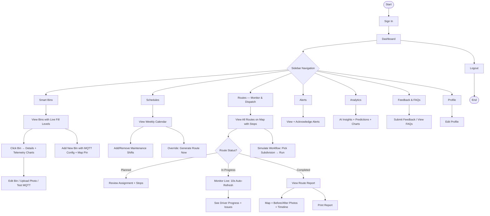
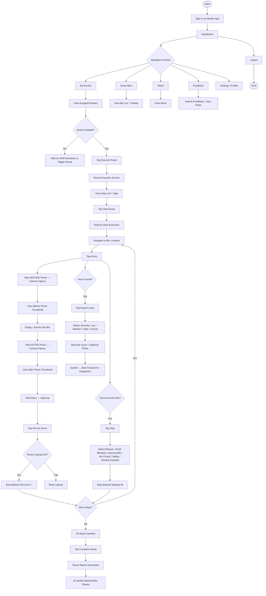
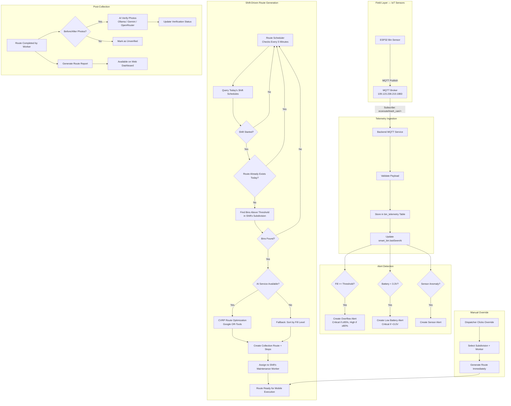

# EcoRoute — Program Workflow

## System Overview

EcoRoute is an AI/IoT smart waste management system for residential subdivisions. It replaces fixed-schedule waste collection with AI-driven "collect-when-needed" routing.

**Three layers:**
- **Field Layer** — ESP32 IoT bins publish fill-level data via MQTT
- **Cloud Layer** — Backend ingests telemetry, runs AI predictions, generates optimized routes
- **Application Layer** — Web dashboard (admin/dispatcher) and mobile app (maintenance)

**Three roles:**
- **Admin** — Full system control (users, settings, subdivisions, schedules, audit logs)
- **Dispatcher** — Operations (bins, routes, alerts, analytics, AI, schedule overrides)
- **Maintenance** — Field execution (assigned routes, before/after photos, issue reporting)

---

## Admin Workflow

```mermaid
flowchart TD
    A([Start]) --> B[Sign In]
    B --> C[Dashboard]
    C --> D{Sidebar Navigation}

    D --> E[User Management]
    E --> E1[View All Users]
    E1 --> E2{Action?}
    E2 -->|Add| E3[Create User: Name, Email, Role, Password]
    E2 -->|Edit| E4[Edit User: Role, Status, Info]
    E2 -->|Deactivate| E5[Deactivate User Account]
    E2 -->|Reactivate| E6[Reactivate User Account]

    D --> F[Smart Bins]
    F --> F1[View All Bins with Live Fill Levels]
    F1 --> F2{Action?}
    F2 -->|Click Bin| F3[Bin Details: Telemetry Charts, Map, Device Info]
    F3 --> F4{Action?}
    F4 -->|Edit| F5[Edit: Location, MQTT Config, Capacity, Threshold]
    F4 -->|Upload Photo| F6[Upload Bin Photo]
    F4 -->|Deactivate| F7[Set Bin Inactive]
    F2 -->|Add Bin| F8[New Bin: Device Code, MQTT Config, Map Pin, Capacity]
    F8 --> F9[Test MQTT Connection]
    F9 --> F10[Create Bin]

    D --> G[Schedules]
    G --> G1[Weekly Calendar Grid]
    G1 --> G2{Action?}
    G2 -->|Add Shift| G3[Select Worker + Subdivision + Days + Time]
    G2 -->|Delete Shift| G4[Remove Shift from Calendar]
    G2 -->|Override| G5[Generate Route Now: Pick Subdivision + Worker]
    G1 --> G6[View Today's Shifts]

    D --> H[Routes]
    H --> H1[View All Routes on Map]
    H1 --> H2{Route Status?}
    H2 -->|Planned| H3[View Pending Assignment + Stops on Map]
    H2 -->|In Progress| H4[Monitor Live: Auto-Refresh 10s]
    H4 --> H5[Track Stop Progress + Issues in Real-Time]
    H2 -->|Completed| H6[View Route Report]
    H6 --> H7[Route Map with Stop Markers]
    H6 --> H8[Before/After Collection Photos]
    H6 --> H9[Issue Summary + Timeline]
    H6 --> H10[Print Report]
    H1 --> H11[Simulate Workflow: Pick Subdivision → Run]

    D --> I[Alerts]
    I --> I1[View All Alerts: Overflow, Low Battery, Sensor, Offline]
    I1 --> I2{Action?}
    I2 -->|Acknowledge| I3[Mark Alert Acknowledged]
    I2 -->|Delete| I4[Delete Alert]

    D --> J[Analytics]
    J --> J1[AI Insights: Auto-Generated via Ollama/Gemini]
    J --> J2[Fill Level Predictions: LSTM Forecasts]
    J --> J3[Collection Performance Charts]
    J --> J4[Bins Serviced Trend]
    J --> J5[Route Efficiency + Driver Performance]

    D --> K[Subdivisions]
    K --> K1[Map with Geofence Polygons + Bin Markers]
    K1 --> K2{Action?}
    K2 -->|Add| K3[Create: Name, Code, Address, Draw Geofence on Map]
    K2 -->|Click| K4[View Detail: Users, Bins, Contact Info]
    K4 --> K5{Action?}
    K5 -->|Assign User| K6[Pick User → Assign to Subdivision]
    K5 -->|Assign Bin| K7[Pick Bin → Assign to Subdivision]
    K5 -->|Edit| K8[Edit Subdivision Details + Geofence]
    K5 -->|Deactivate| K9[Deactivate Subdivision]

    D --> L[Audit Logs]
    L --> L1[View All System Activity]
    L1 --> L2[Expand Entry: JSON Diff of Old/New Values]

    D --> M[Feedback & FAQs]
    M --> M1[View All Feedback + Reply]
    M --> M2[Manage FAQs: Add, Edit, Delete]

    D --> N[Settings]
    N --> N1[General: Subdivision Name, Depot Address]
    N --> N2[Thresholds: Fill %, Low Battery Voltage]
    N --> N3[AI Provider: Ollama / Gemini / OpenRouter]
    N3 --> N4[Test AI Connection]
    N --> N5[Notification Preferences]

    D --> O[Profile]
    O --> O1[View/Edit Name, Phone]

    C --> P[Logout]
    P --> Q([End])
```

---

## Dispatcher Workflow

---

## Maintenance Workflow (Mobile App)

---

## Automated Backend Workflow

---

## Data Flow Summary

| Step | Source | Action | Destination |
|------|--------|--------|-------------|
| 1 | ESP32 Sensor | Publish fill level via MQTT | MQTT Broker (109.123.238.215:1883) |
| 2 | MQTT Broker | Forward to subscriber | Backend Telemetry Processor |
| 3 | Telemetry Processor | Store reading, create alerts if thresholds breached | PostgreSQL (bin_telemetry + alert tables) |
| 4 | Admin/Dispatcher | Enroll maintenance shift schedules | shift_schedule table |
| 5 | Route Scheduler (5min) | Detect shift start + bins above threshold | AI Service (CVRP) or fallback sort |
| 6 | AI Service | Return optimized stop sequence | Backend creates route + stops |
| 7 | Backend | Assign route to shift's maintenance worker | collection_route + route_stop tables |
| 8 | Maintenance (Mobile) | Execute stops: arrive → before photo → service → after photo | Backend via REST API |
| 9 | Backend | AI verifies before/after photos | Ollama / Gemini / OpenRouter |
| 10 | Backend | Generate route completion report | Web dashboard for dispatcher review |

---

## Page Map by Role

### Admin sees:
Dashboard · Smart Bins · Routes · Alerts · Users · **Schedules** · Analytics · **Subdivisions** · **Audit Logs** · Feedback & FAQs · Settings · Profile

### Dispatcher sees:
Dashboard · Smart Bins · Routes · Alerts · Analytics · Feedback & FAQs · Settings · Profile

### Maintenance sees:
Dashboard · Smart Bins · Routes · **My Routes** · Alerts · Feedback & FAQs · Settings · Profile

---

## Default Accounts

| Role | Email | Password |
|------|-------|----------|
| Admin | admin@ecoroute.io | password123 |
| Dispatcher | dispatcher@ecoroute.io | password123 |
| Maintenance | maintenance@ecoroute.io | password123 |
