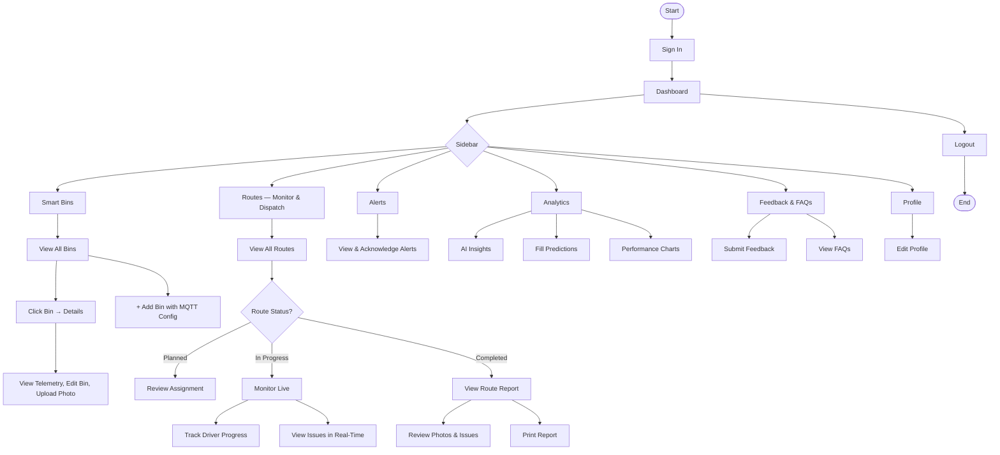
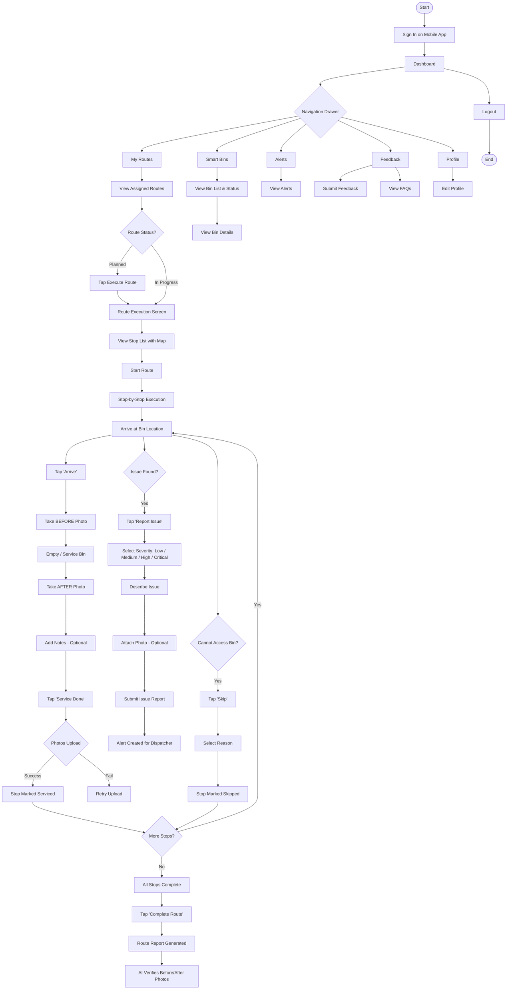
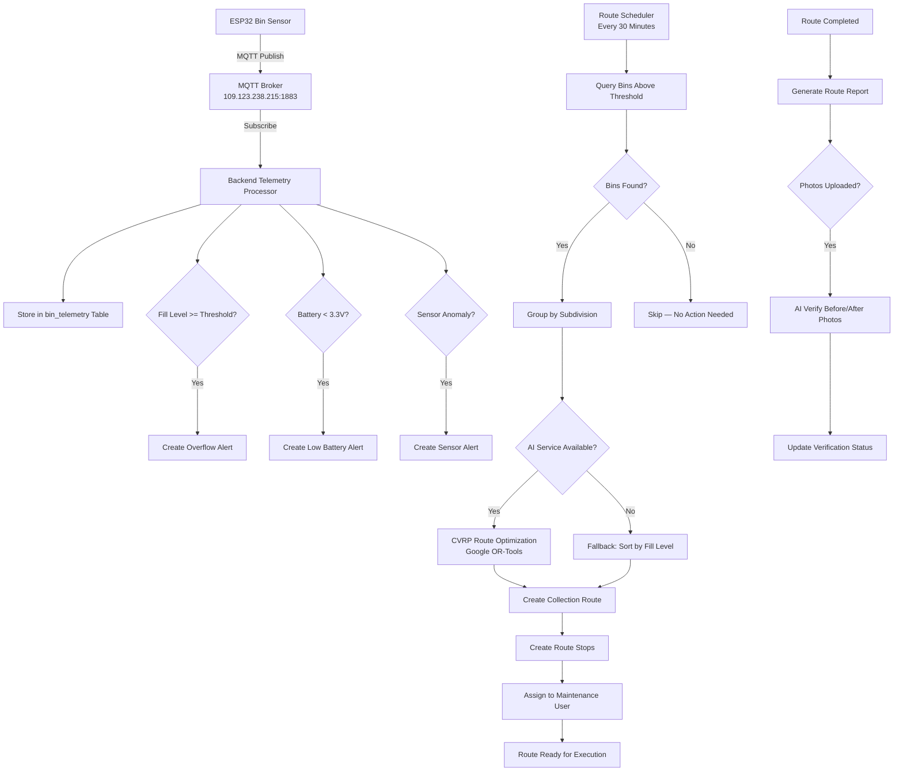

# EcoRoute — Program Workflow

## System Overview

EcoRoute is an AI/IoT smart waste management system. The workflow spans three layers:
- **Field Layer** — ESP32 IoT bins publish fill-level data via MQTT
- **Cloud Layer** — Backend ingests telemetry, runs AI predictions, generates optimized routes
- **Application Layer** — Web dashboard (admin/dispatcher) and mobile app (maintenance)

---

## Admin Workflow

```mermaid
flowchart TD
    A([Start]) --> B[Sign In]
    B --> C[Dashboard]
    C --> D{Sidebar}

    D --> E[User Management]
    E --> E1[View User List]
    E1 --> E2{Click User?}
    E2 -->|Yes| E3[View Account]
    E3 --> E4{Action?}
    E4 -->|Edit| E5[Edit User Details]
    E5 --> E6[Save Changes]
    E4 -->|Deactivate| E7[Deactivate Account]
    E4 -->|Reactivate| E8[Reactivate Account]
    E2 -->|No| E9[+ Add User]
    E9 --> E10[Enter Name, Email, Role, Password]
    E10 --> E6

    D --> F[Smart Bins]
    F --> F1[View All Bins]
    F1 --> F2{Click Bin?}
    F2 -->|Yes| F3[Bin Details Page]
    F3 --> F4[View Live Telemetry & Charts]
    F3 --> F5{Action?}
    F5 -->|Edit| F6[Edit Bin: Location, MQTT, Capacity, Threshold]
    F5 -->|Upload Photo| F7[Upload Bin Photo]
    F5 -->|Delete| F8[Set Bin Inactive]
    F2 -->|No| F9[+ Add Bin]
    F9 --> F10[Enter Device Code, MQTT Config, Map Location, Capacity]
    F10 --> F11[Test MQTT Connection]
    F11 --> F12[Create Bin]

    D --> G[Routes]
    G --> G1[View Auto-Generated Routes]
    G1 --> G2{Route Status?}
    G2 -->|In Progress| G3[Monitor Live - Auto-Refresh 10s]
    G3 --> G4[View Driver Progress on Map]
    G3 --> G5[View Stop Status Updates]
    G3 --> G6[View Reported Issues]
    G2 -->|Completed| G7[View Route Report]
    G7 --> G8[Review Before/After Photos]
    G7 --> G9[Review Issues & Skipped Stops]
    G7 --> G10[Print Report]
    G2 -->|Planned| G11[View Pending Assignment]

    D --> H[Alerts]
    H --> H1[View All Alerts]
    H1 --> H2[Filter by Type: Overflow / Low Battery / Sensor Anomaly / Offline]
    H2 --> H3{Action?}
    H3 -->|Acknowledge| H4[Mark Alert Acknowledged]
    H3 -->|Delete| H5[Delete Alert]

    D --> I[Analytics]
    I --> I1[View Dashboard Metrics]
    I --> I2[AI Insights - Auto-Generated]
    I --> I3[Fill Level Predictions]
    I --> I4[Collection Performance Charts]

    D --> J[Audit Logs]
    J --> J1[View All System Activity]
    J1 --> J2[Expand Entry for JSON Diff]

    D --> K[Settings]
    K --> K1[General: Subdivision Name, Depot Address]
    K --> K2[Thresholds: Fill %, Low Battery Voltage]
    K --> K3[AI Provider: Ollama / Gemini / OpenRouter]
    K3 --> K4[Test AI Connection]

    D --> L[Feedback & FAQs]
    L --> L1[View All Feedback]
    L1 --> L2[Reply to Feedback]
    L --> L3[Manage FAQs]
    L3 --> L4[Add / Edit / Delete FAQ]

    D --> M[Subdivisions]
    M --> M1[View All Subdivisions]
    M1 --> M2[Create / Edit / Delete Subdivision]

    D --> N[Profile]
    N --> N1[View Profile]
    N1 --> N2[Edit Name / Phone]

    C --> O[Logout]
    O --> P([End])
```

---

## Dispatcher Workflow

---

## Maintenance Workflow (Mobile App)

---

## Automated Backend Workflow

---

## Data Flow Summary

| Step | Source | Action | Destination |
|------|--------|--------|-------------|
| 1 | ESP32 Sensor | Publish fill level via MQTT | MQTT Broker |
| 2 | MQTT Broker | Forward to subscriber | Backend Telemetry Processor |
| 3 | Telemetry Processor | Store reading, check thresholds | PostgreSQL + Alerts |
| 4 | Route Scheduler (30min) | Find bins above threshold | AI Service (CVRP) |
| 5 | AI Service | Return optimized route | Backend creates route + stops |
| 6 | Backend | Assign route to maintenance | Mobile app notification |
| 7 | Maintenance (Mobile) | Execute stops, take photos | Backend via REST API |
| 8 | Backend | AI verifies photos | Ollama / Gemini / OpenRouter |
| 9 | Backend | Generate route report | Web dashboard |
| 10 | Dispatcher (Web) | Monitor live, review reports | Dashboard |
